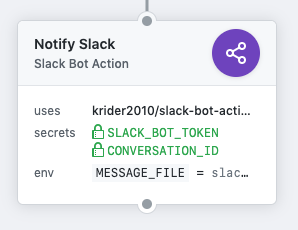

# slack-bot-action

This GitHub Action wraps the Slack [chat.postMessage](https://api.slack.com/methods/chat.postMessage) API method for posting to channels, private groups, and DMs. It is flexible enough to work with any _conversation ID_ and can take hardcoded values or the output of previous Action steps in a given Workflow.

Messages are sent using [Slack bot tokens](https://api.slack.com/docs/token-types) which are (as suggested by [Slack themselves](https://medium.com/slack-developer-blog/the-latest-with-app-tokens-fe878d44130c)) more resilient to installing users disappearing and because they allow a better kind of integration. More capabilities, and more importantly for making these messages stand out, supporting a range of [bot users](https://api.slack.com/bot-users#creating-bot-user) to customise how the message appears in Slack.

## Usage

This Action can easily be installed either via the GitHub Actions Marketplace or by referencing it in your Workflow file. Either in the visual editor or the text editor as you prefer.



Be sure to use the current latest release (tag) when referencing this Action. It is far safer to lock to a specific version for your Workflow and allows you the choice of when to upgrade.

### Using Action Output

A lot of the time, the message you want to send to Slack is going to be dependent on what has happened in previous Actions in the Workflow. In this case, the URL or user, or outcome of other processing is important. Since we cannot pass details from one Action to another in Workflow files, we have to be creative about it! Actions specify that `$GITHUB_WORKSPACE` is available to all Actions, and it is not thrown away during a Workflow run. This workspace means we can have other Actions output a Slack message as JSON (in the [format specified by Slack](https://api.slack.com/methods/chat.postMessage)) and then have this Action send it to Slack.

```
action "Notify Slack" {
  uses = "krider2010/slack-bot-action@1.0.1"
  secrets = ["SLACK_BOT_TOKEN", "CONVERSATION_ID"]
  env = {
    MESSAGE_FILE = "slack-message.json"
  }
  needs = ["Another Action To Generate slack-message.json"]
}
```

### Providing Hardcoded Data

If your need is more along the lines that you want to notify a Slack conversation if a release happens (for example) and the release page, with the latest releases always on the same URL (e.g. `https://github.com/user-or-org/repo-name/releases`), then you may want to use hardcoded values. You can do this with the following setup:

```
action "Notify Slack" {
  uses = "krider2010/slack-bot-action@1.0.1"
  secrets = ["SLACK_BOT_TOKEN"]
  env = {
    MESSAGE_STRING = "{ \"channel\": \"C1234567890\", \"text\": \"We've created a new release! Why not check it out at http:\/\/github.com\/awesome\/software\/releases :tada:\" }"
  }
}
```

As with the file from a previous Action running, the information provided to this action must be a valid JSON object, though in this case encoded as a String. Which handily, the visual editor on GitHub will do for you. You only need to escape things if you are editing the Workflow as a text file :grin:

## Setup

This GitHub Action requires a Slack Bot token which means doing some setup on Slack first. Follow the steps provided by Slack and create a Slack app, and then create a bot user. The [Slack Getting Started](https://api.slack.com/bot-users#getting-started) Guide walks you through these two first steps pretty nicely. I'd recommend setting an icon as well as a name/username for the Bot User, so it looks more distinct when posting.

For this use case, you do not need to worry about Step 2 of the guide. You can jump straight to [Step 3](https://api.slack.com/bot-users#installing-bot) and install the bot to a workspace. Don't forget to note down the _Bot User OAuth Access Token_ as this is going to be needed to run the Action. You are now all done!

## Secrets Needed

Once you've set up the Slack integration take the access token (starting with `xoxb-`) and set that as the Secret named `SLACK_BOT_TOKEN` on this Action inside the GitHub visual editor.

### So What About CONVERSATION_ID?

It's possible to set CONVERSATION_ID either as a secret or specify it in the JSON provided to the Action. Though do note that in the JSON, it is referenced as `channel` in by Slack!. Any provided as Secret a **will** override one in the JSON. For many conversations, such as channels, it's not important whether that ID is protected or not. However, if, for example, you want it to go to a private group and not have anyone try and work out what/where, then consider storing it as a Secret and providing it via the Vault.

If you use the Desktop or Mobile clients for Slack, the IDs are hidden. You can discover them by (from the Desktop client) right clicking on the channel/private group/individual and selecting _Copy link_. This link is of the form `https://myworkspace.slack.com/messages/CONVERSATION_ID`. It's that last piece of the URL you need to provide which is a combination of capital letters and numbers. At the time of writing, it seems that DMs start with a D, Groups (private channels) start with G, and Channels with C. If you use the web interface the ID you need is the last part of the URL bar at the top :smile:

## Other Information

The Action requires that either `MESSAGE_FILE` or `MESSAGE_STRING` is provided as part of the `env` provided to the running Action. If neither is there, the Action will report an error to that effect. These must be VALID JSON as already described above.

If the message cannot be sent to Slack for whatever reason, that error is returned in the logging of the Action, and the Action page reflects this in the status of the Action run.
